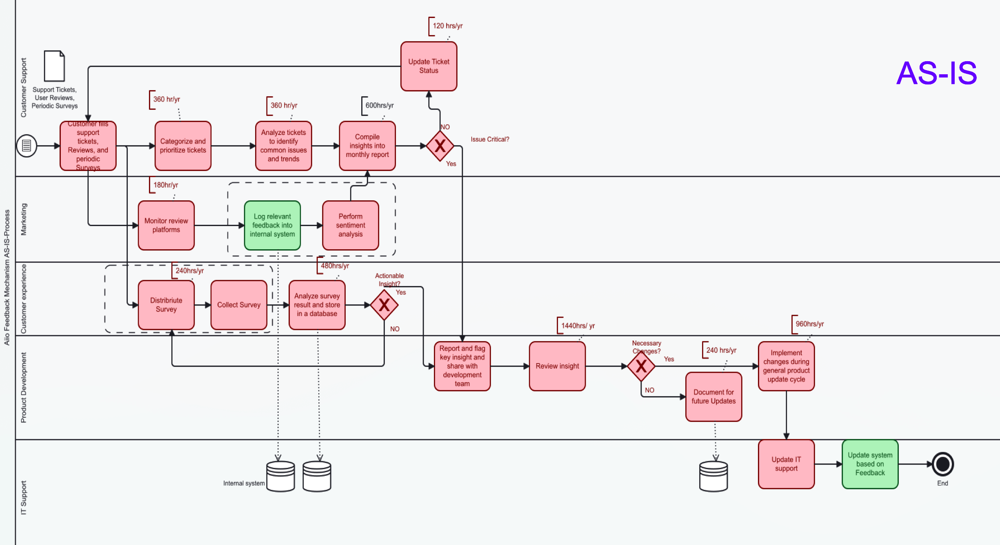

# Process Innovation
# WorkFlow Automation across-departments

Process Innovation 

This repository documents the Process Innovation Proposal aimed at automating internal workflows across departments. The project includes BPMN 2.0 diagrams to illustrate the current ("AS-IS") and future ("TO-BE") processes, highlighting improvements in IT strategy, employee productivity, and operational efficiency.

Project Overview

The proposal addresses key challenges in current workflows in aio GmbH, focusing on:

Removing redundancies to streamline processes.
Enhancing IT strategy to align with organizational goals.
Improving employee productivity by reducing manual tasks.
Achieving cost and time savings through automation and optimization.
Features

AS-IS Diagrams:
Detailed Business Process Model and Notation (BPMN 2.0) diagrams illustrating current workflows and identifying pain points.
TO-BE Diagrams:
Optimized workflows showcasing automated processes and the envisioned future state.
Automation Strategy:
Tools and technologies proposed to enable seamless automation across departments.
Benefits

Increased Efficiency: Elimination of redundant steps reduces process delays.
Cost Reduction: Automation minimizes labor-intensive tasks, resulting in cost savings.
Enhanced IT Alignment: Processes better integrate with IT infrastructure, enabling scalable solutions.
Employee Empowerment: Productivity improves as routine tasks are automated, freeing time for strategic work.
Repository Contents

* AS-IS_Diagrams/: Contains BPMN 2.0 diagrams of current workflows.
* TO-BE_Diagrams/: Contains BPMN 2.0 diagrams of optimized workflows with Human in the Loop.
* Documentation/: Detailed analysis and implementation steps.
* Scripts/: Automation scripts.
How to Use

Review the AS-IS_Diagrams/ folder to understand current workflows.
Compare with the TO-BE_Diagrams/ folder to see proposed improvements.
Refer to the Documentation/ folder for detailed explanations and implementation guidance.

